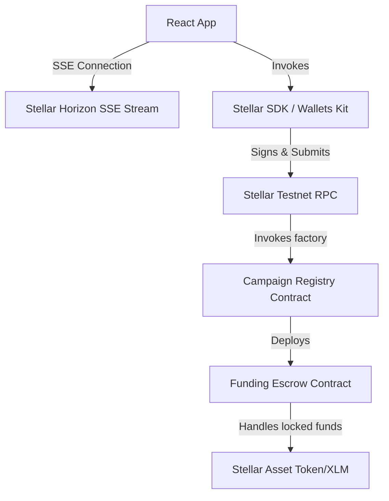
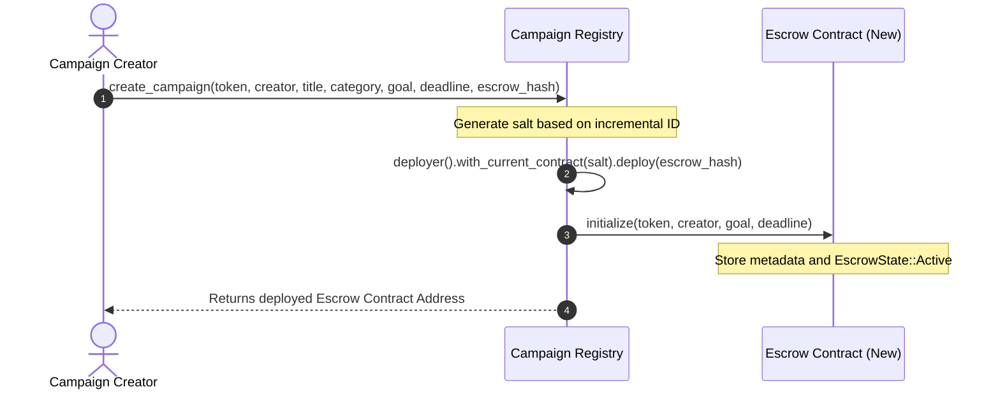

# [FundForge](https://fund-forge.netlify.app/)

FundForge is a decentralized crowdfunding dApp built on the Stellar blockchain that enables creators, startups, NGOs, and innovators to raise funds transparently and securely using XLM and custom Soroban smart contract escrows.

# [Demo Video](https://drive.google.com/file/d/1kEjUdYJ0kyArUjdhU0oRqZnscUn9Ry-t/view?usp=sharing)

## Production MVP

FundForge is a production-ready Level 4 MVP featuring live testnet deployment, a mobile-responsive frontend architecture, and complete telemetry and security monitoring capabilities.

* **Live Deployment URL**: [https://fund-forge.netlify.app/](https://fund-forge.netlify.app/)
* **Production Architecture**: Designed around a factory pattern where a central registry contract dynamically deploys self-contained smart escrow contracts with full state machine lifecycle tracking on Stellar Testnet.
* **Real User Onboarding**: Supported by an interactive step-by-step onboarding walkthrough that leads new users from wallet creation through campaign backing and cancellation management.
* **Real Wallet Interactions**: Integrates Freighter and Albedo wallets using the Stellar Wallets Kit, signing and submitting testnet transactions.
* **Telemetry Integrations**: Features a custom local-state, console-logged, and API-dispatchable analytics framework alongside error tracking services.
* **Feedback Pipeline**: Synchronizes live feedback surveys via Google Forms directly to public spreadsheets.

## Problem Statement

Traditional crowdfunding platforms suffer from:
1. **High Fee Structures**: Middlemen charge 5-10% of total raised funds.
2. **Centralized Discretion**: Platforms can unilaterally freeze accounts, block campaigns, or delay payouts.
3. **Lack of Settlement Transparency**: Contributors have no cryptographic guarantee that their funds are allocated or refunded correctly.
4. **Siloed Systems**: High friction for cross-border contributions due to complex banking relationships.

## Solution

FundForge resolves these challenges by executing campaign structures directly on-chain using Soroban Smart Contracts:
1. **Negligible Transaction Fees**: Average transaction fees are fractions of a cent on the Stellar network.
2. **Decentralized Escrows & State Machine**: Funds are locked inside trustless escrow contracts governed by explicit `EscrowState` logic (Active, Successful, Failed, Cancelled).
3. **Automated Settlements & Cancellation Rights**: Payouts are triggered upon goal completion. Creators can explicitly cancel active campaigns, enabling immediate sponsor refunds.
4. **Global & Borderless**: Open to anyone in the world with a Stellar wallet.

## Why Stellar

Stellar provides the optimal foundation for crowdfunding:
- **Fast Settlements**: 5-second ledger times guarantee instant receipt of contributions and settlement transactions.
- **Soroban Smart Contracts**: Rust-based WASM virtual machine offers high-performance execution, predictable fees, and memory safety.
- **Native Wallet Ecosystem**: Robust wallet integrations (Freighter, Albedo) allow users to seamlessly manage, sign, and authorize transactions.

---

## Features

- **Wallet Integration**: Native connection to Stellar extension wallets.
- **Multi-Wallet Support**: Seamless sign-in and signing via Freighter and Albedo.
- **Campaign Creation**: Dynamic deployment of dedicated escrow contracts directly via a factory registry with category tagging and metadata.
- **Donations & Escrows**: Real-time contributions directly to on-chain escrow pools with custom `EscrowState` state tracking.
- **Campaign Cancellation & Refunds**: Creator-led campaign cancellation triggering immediate contributor refunds prior to deadline.
- **Event Streaming**: Horizon-based Server-Sent Events (SSE) stream activity in real-time.
- **Transaction Center**: Tracking system for transaction state transitions (processing, confirmed, failed).
- **Analytics**: Recharts telemetry panel displaying network usage, transaction frequency, and contribution volumes.
- **Settings**: Advanced developer control dashboard to configure RPC node endpoints, Horizon URLs, and visual modes.
- **Smart Contract Upgrades**: Admin-controlled and Creator-controlled bytecode upgrade paths using Soroban `update_current_contract_wasm`.

---

## Architecture Diagram



---

## Smart Contract Design

### Campaign Registry Contract (`contracts/campaign-registry`)
The registry contract acts as a central campaign directory and deployment factory.
- **Factory Deployer**: Deploys new instances of the `funding-escrow` contract dynamically using salt values.
- **Admin Configuration**: Restricts initialization and WASM upgrade procedures to authorized admins (`require_auth()`).
- **Category Querying**: Supports category indexing (`get_campaigns_by_category`) and single ID metadata queries.

### Funding Escrow Contract (`contracts/funding-escrow`)
Each crowdfunding campaign has a dedicated, self-contained escrow contract with a strict state machine:
- **`EscrowState` Enum**: Evaluates state dynamically (`Active`, `Successful`, `Failed`, `Cancelled`).
- **Campaign Cancellation (`cancel_campaign`)**: Authorized creators can cancel active campaigns early, transitioning state to `Cancelled`.
- **Claim Operations (`claim_funds`)**: Releases campaign tokens to creator *only* if goal is reached after deadline.
- **Refund Operations (`claim_refund`)**: Immediate refund access for contributors if campaign is `Cancelled` or `Failed`.
- **Explicit Contract Errors (`#[contracterror] Error`)**: Replaces vague panics with numbered error codes (`1: AlreadyInitialized`, `6: DeadlinePassed`, `12: NotActive`, `13: AlreadyCancelled`).

---

## Inter-Contract Communication



---

## Tech Stack

- **Frontend**: Vite, React, TypeScript, Tailwind CSS v4, Recharts, React Query, Zustand
- **Smart Contracts**: Rust, Soroban SDK (v22.0.11), WebAssembly Target (`wasm32-unknown-unknown`)
- **Infrastructure**: Stellar CLI, Horizon API, Netlify
- **Deployment URL**: [https://fund-forge.netlify.app/](https://fund-forge.netlify.app/)

---

## Installation & Setup

### Prerequisite Setup
1. Install [Rust](https://www.rust-lang.org/tools/install) and add the WebAssembly target:
   ```bash
   rustup target add wasm32-unknown-unknown
   ```
2. Install [Stellar CLI](https://developers.stellar.org/docs/tools/developer-tools/stellar-cli):
   ```bash
   cargo install --locked stellar-cli --features opt
   ```

### Local Project Build
1. Clone the repository and install npm dependencies:
   ```bash
   npm install
   ```
2. Build Soroban smart contracts:
   ```bash
   npm run contract:build
   ```
3. Run the React development server:
   ```bash
   npm run dev
   ```

---

## Environment Variables

Copy `.env.example` to `.env` or configure variables in your environment:
```env
VITE_REGISTRY_CONTRACT="CCGXNGQBDWTS5NRHD4ZOHUN6GL3JKSX225UWX77353V4P7LAHNHT3BPN"
VITE_ESCROW_WASM_HASH="059d15d51c418db21193155e63f0d06938b9dcf31ddbc08199d39431a68fb352"
VITE_STELLAR_NETWORK="TESTNET"
VITE_RPC_URL="https://soroban-testnet.stellar.org"
VITE_HORIZON_URL="https://horizon-testnet.stellar.org"
```

---

## Testing Verification

### Rust Soroban Contracts (`cargo test`)
```bash
npm run contract:test
```
**Test Results**:
```text
running 3 tests
test test::test_registry_initialization ... ok
test test::test_unauthorized_upgrade - should panic ... ok
test test::test_registry_double_initialization - should panic ... ok

running 6 tests
test test::test_cancel_campaign_and_refund ... ok
test test::test_escrow_funding_success ... ok
test test::test_refund_on_campaign_failure ... ok
test test::test_claim_funds_fails_if_goal_not_reached - should panic ... ok
test test::test_escrow_double_initialization - should panic ... ok
test test::test_unauthorized_escrow_upgrade - should panic ... ok

test result: ok. 9 passed; 0 failed
```

### React Frontend Component Suites (`npm test`)
```bash
npm test
```
**Test Results**:
```text
 ✓ src/__tests__/SettingsPage.test.tsx (1 test)
 ✓ src/__tests__/CampaignCard.test.tsx (1 test)
 ✓ src/__tests__/WalletCenterPage.test.tsx (1 test)
 ✓ src/__tests__/Navbar.test.tsx (1 test)
 ✓ src/__tests__/DashboardPage.test.tsx (1 test)
 ✓ src/__tests__/AnalyticsPage.test.tsx (1 test)

 Test Files  6 passed (6)
      Tests  6 passed (6)
```

---

## Security Audit & Hardening

1. **Authorization Verification**: Every state-modifying function enforces `require_auth()` for the appropriate caller (e.g. `creator` for initialization and campaign cancellation; `admin` for registry upgrades).
2. **Explicit Error Code Enums**: Smart contracts utilize `#[contracterror]` enums (`Error::AlreadyInitialized`, `Error::NotActive`, `Error::DeadlinePassed`) instead of untyped string panics.
3. **Reentrancy & Double-Withdraw Protection**: Instance flags (`DataKey::Withdrawn`, `EscrowState::Cancelled`) and zeroing out persistent contributor ledger records prevent double-claiming funds or refunds.
4. **State Machine Integrity**: Dynamic state evaluation (`get_state`) guarantees that campaigns cannot receive funds once cancelled or after deadline expiry.

---

## Contract Addresses & Verified Transactions

- **Campaign Registry Contract**: `CCGXNGQBDWTS5NRHD4ZOHUN6GL3JKSX225UWX77353V4P7LAHNHT3BPN`
- **Funding Escrow WASM Hash**: `059d15d51c418db21193155e63f0d06938b9dcf31ddbc08199d39431a68fb352`
- **Escrow WASM Installation**: `de81ee62ddd6219643aa9bf1b72861a48768dea2b3a882b0d429689016bc907f`
- **Registry Deployment**: `177150cd2a1fccf8e791d5e48b319367ef5f5e0fd6bf20496e442dcdcd4e7f76`
- **Registry Initialization**: `84b34dd187e600a9f507646911152886dba813f197f43ce59fcf0847642ea99a`
- **On-chain Campaign Creation**: `690b3b89f4cf29137ea9875baa1e8c5ed9c133233a6847e554182beb7908c3ef`

---

## Reviewer Resources

- **Live Application**: [https://fund-forge.netlify.app/](https://fund-forge.netlify.app/)
- **Demo Video**: [FundForge Demo Video](https://drive.google.com/file/d/1kEjUdYJ0kyArUjdhU0oRqZnscUn9Ry-t/view?usp=sharing)
- **User Feedback Form**: [https://forms.gle/Nva4R7Xg2ZGhNEL77](https://forms.gle/Nva4R7Xg2ZGhNEL77)
- **User Response Sheet**: [https://docs.google.com/spreadsheets/d/1FyS6kne5vcB5rtbjXIVwekUv2kjuMw8t694haEj9lyM/edit?usp=sharing](https://docs.google.com/spreadsheets/d/1FyS6kne5vcB5rtbjXIVwekUv2kjuMw8t694haEj9lyM/edit?usp=sharing)

